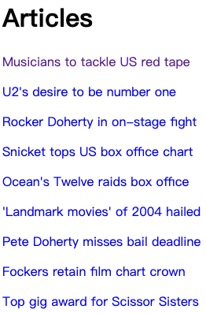
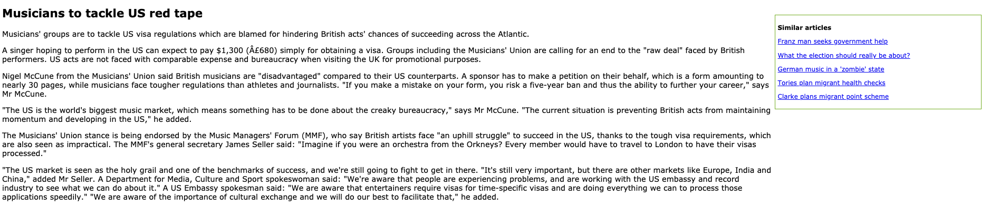

# BBCRecommendation

## Project Introduction

In this project, I'm using a database from Stanford's GloVe project. Each word is represented by a a vector of 300 floating-point numbers. Two words are considered related if there word vectors are close in this 300 dimensional space.
- Built a simple article recommendation engine using a semi-recent advance in natural language processing called word2vec.
- Computed the centroid of a document's cloud of word vectors.
- Given an article, compute the distance from its centroid to every other article's centroid.
- Launched a web server by Flask.

## A screenshot of how the system looks like:

### Homepage

### After we click on the news "Musicians to tackle US red tape"

BBCRecommendation is a web application that displays a list of recommended BBC articles on the side when you read an article. Once you click on any article suggested on the side, it will direct you to the recommended articles that are similar based on the contents.